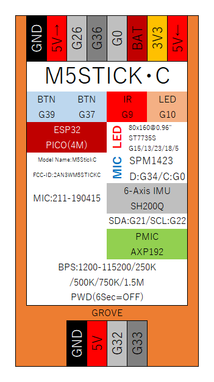
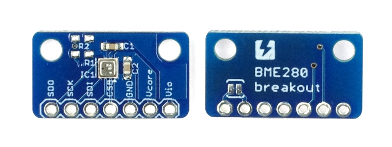
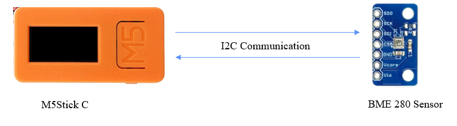
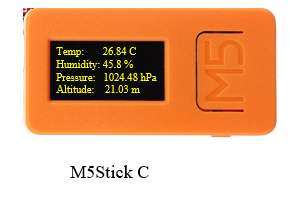
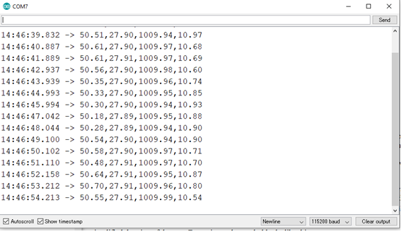

# Real-Time Data Infographics 
There is an adage in English language that a picture is worth a thousand words. It refers to the notion that complex data and descriptions can be conveyed with just a single picture. So, I am going to make an infographic which shows the real-time data of temperature, humidity and pressure in interactive way. By looking at the infographic people can understand easily the current condition of weather. And the window of infographic can also log data in a text file on command of mouse click.
M5StickC with Arduino programming will be used to process the BME280 sensor data and Processing language is used to create infographic. The data values are also display in M5StickC LCD concurrently with the Infographic.

# Items Used
-	[BME280 Temperature, Humidity and Pressure Sensor](https://www.adafruit.com/product/2652)
-	[M5StickC IOT Development Board](https://m5stack.com/products/stick-c)
-	[Breadboard](https://www.adafruit.com/product/64)
-	[Male to Male Jumper Wires](https://www.adafruit.com/product/758)
- [Arduino IDE](https://www.arduino.cc/en/software)
- [Processing IDE](https://processing.org/reference/environment/)

# Skills Required
- Breadboarding
- I2C Serial Communication protocol
- Basic Arduino Programming
- Basic Processing Programming

# Implementation Steps

## Step-1: Install IDEs, Libraries and Board Packages
Install Arduino IDE and Processing IDE to the PC along with the required libraries in Arduino IDE. The required libraries are M5 Stick C and Adafruit BME280. Also install M5StickC board package in Arduino IDE.

## Step-2: Wire Up the BME280 Sensor and M5StickC
Connect BME280 sensor and M5 Stick C using breadboard and jumper wires. I am joining the sensor and M5 Stick C using I2C interface communication. Follow the following method for I2C serial communication:

- Connect ‘vio’ pin of sensor to the 3v3(3 volts) of M5 Stick C for the power supply.
- Connect ‘GND’ of sensor to the ‘GND’ of M5 Stick C.
- Connect ‘SDI’ pin of sensor to the ‘G0’ of the M5 Stick C.
- Connect ‘SCK’ pin of sensor to the ‘G26’ of the M5 Stick C.
- Lastly, connect ‘SDO’ of the sensor to ‘GND’ for the actual reading of values over I2C serial communication.

### M5StickC Pinout

### BME280 Sensor Pinout

### M5StickC and BME280 I2C Communication

## Step-3: Coding M5StickC Program Using Arduino IDE\
Now write the code in Arduino IDE for M5 Stick C to access temperature, pressure and humidity data from the sensor and displaying the data in M5StickC LCD and to the Serial Monitor. The data output of the serial monitor must be separated by commas so that we can get access to these individual data values in processing. The code can be found in the file 'M5StickC_Sensor_Data_Output.ino'. The output in serial monitor must be in the format:
                50.66, 27.88, 1011.25, 10.12.
                
The first value of 50.66 is humidity percentage, second value of 27.88 is temperature in degree Celsius, the third value of 1011.25 is atmospheric pressure in millibars and the last value of 10.12 is the altitude in meters.

### Data Values Display on M5StickC LCD

### Output Data in Arduino Serial Monitor

## Step-4: Accessing Sensor Data in Processing From Arduino Serial Monitor
The M5StickC program outputs data into the Arduino Serial Monitor. Now, it's time to access data into processing from Arduino Serial Monitor. After accessing data, we will make the interactive infographic by using these data. The processing program can be found in 'Temp_Pressure_Infograph.pde' file.

### Real Time Interactive Data Visualization Dashboard

This is an interactive visualization. There are two thermometers red and blue. The red thermometer is for temperature and the blue thermometer is for atmospheric pressure. The mercury of the both thermometers raises to the significant scale according to the given real time value of temperature and pressure. The red tehrmometers scales are both in celsius and fahrenheit. Also the blue thermometers scales are in both pascas and millibars. The current real time values of temperature in fahrenheit and celcius and pressure in pascal and millibars are displayed in text also. These all values are changes in every seconds. The water drop represents the currrent humidity percentage and the two traingle like icons represent the current alitiude of the location from sea level. Time and date are displayed at the right bottom corner.

### Data Logging 
The start log bottom is for storing the values. When you click the button the data starts to log in a newly created text file until the stop log button is clicked. All the values are logged in the text file along with current date and time. The values are in the interval of one second. A screenshot of the log file is as follows:

